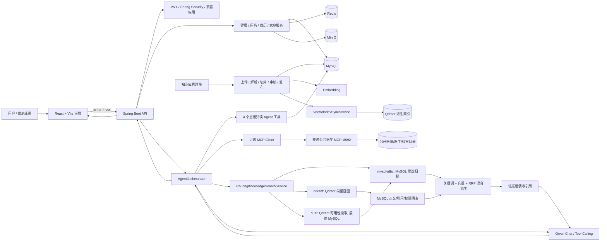

# 康伴智能医疗助手

康伴是一个前后端分离的家庭健康管理系统，也是一个面向医疗场景的 Agent Demo。系统围绕“当前患者”组织健康数据、家庭权限和 AI 问诊，通过自研 Agent 编排层连接患者私有只读工具、可选的天津公共医疗 MCP、MySQL 事实源、Qdrant 可重建向量索引和 Qwen 模型。

> 健康数据和 AI 输出仅用于功能演示与健康信息参考，不替代医生诊断、处方或急救建议。

## 项目定位

本项目不是简单的聊天页面，而是一条可运行的 Agent 链路：

1. 用户选择本人或授权家庭成员作为当前患者；
2. `AgentToolPlanner` 或可选的 Qwen Function Calling 根据问题选择只读工具；
3. Agent 查询患者快照、健康指标、当前用药和近期病历，身份范围由服务端上下文决定；
4. 对公共健康资料和家庭私有资料执行分域 RAG，Qdrant 负责向量召回，MySQL 回查正文、引用和权限事实；
5. 可选调用天津公共医疗 MCP 查询医院、医生和科室等公开目录；
6. 对健康记录和用药计划只生成操作提案，用户确认后才由原有业务服务写入；
7. 通过 SSE 将状态、工具轨迹、引用、操作提案和最终答案返回前端，并支持已落库消息重放。

当前核心 Agent 编排为项目内自研实现，未依赖 LangChain4j；Spring AI 只用于独立天津公共医疗 MCP 服务及其 MCP 传输适配，不替代 `AgentOrchestrator`。核心实现位于 [`kangban-server/src/main/java/com/kangban/agent`](kangban-server/src/main/java/com/kangban/agent)。

## 架构概览

完整架构图见 [`docs/agent-architecture.md`](docs/agent-architecture.md)。



## 主要功能

- 登录、注册、图片人机验证、JWT 刷新和管理员协助找回密码；
- 首页、健康指标录入、健康趋势和健康报告；
- 家庭成员管理、家庭授权、成员切换和数据隔离；
- 用药计划、服药记录和药物相互作用提示；
- 病历上传、病历详情、分享和 PDF 下载；OCR 入口保留，真实 OCR 服务未纳入本版本；
- AI 问诊：患者切换、数据库健康概况、只读工具调用、多轮会话、操作提案和 SSE；
- 患者私有 Agent 工具：健康快照、健康指标、当前有效用药、近期病历 4 个只读工具；
- 公共医疗 MCP：可选的天津 MCP 服务，提供医院、医院详情、医生、科室 4 个公开目录工具，不接收患者数据；
- 公共 RAG：TXT / Markdown / 文本型 PDF 上传、解析、切片、Embedding、审核、发布、检索和引用；
- 私有病历知识索引：MySQL 保存正文、引用和权限事实，Qdrant 保存可重建向量索引，按用户、患者和家庭权限过滤；
- RAG 路由：支持 `mysql-jdbc`、`dual`、`qdrant` 三种模式，Qdrant 召回后回 MySQL 做正文、引用和权限复核；
- 指标、工具轨迹、引用和关键失败状态的可观测性；
- Flyway 数据库迁移、前后端测试和 ECS/Nginx 部署文件。

扫描版 PDF OCR 暂未纳入本版本，文本型 PDF 可以入库。

## Agent 工具边界

Agent 工具按数据域隔离，患者私有工具和公共医疗 MCP 不混用：

| 数据域 | 工具 | 作用与限制 |
| --- | --- | --- |
| 患者私有 | `get_patient_health_snapshot` | 读取当前患者近况快照，身份和家庭权限由服务端上下文决定 |
| 患者私有 | `get_health_metrics` | 读取健康指标，可按指标名称和数量限制查询范围 |
| 患者私有 | `get_active_medications` | 读取当前有效用药，不执行新增、修改或删除 |
| 患者私有 | `get_recent_medical_records` | 读取近期病历摘要，不允许 Agent 直接改写病历 |
| 天津公共 MCP | `search_hospitals` / `get_hospital_info` | 查询公开医院目录和医院详情，不接收患者数据 |
| 天津公共 MCP | `search_doctors` / `search_departments` | 查询公开医生、职称和科室目录，不接收患者数据 |

健康记录和用药计划属于写操作，不注册为 Agent Tool。Agent 只能生成带参数、过期时间和幂等指纹的操作提案；用户确认后，服务端再次校验登录态、家庭权限和业务参数，再调用原有领域服务写入并审计。

## 技术栈

### 前端

- React 19
- Vite 8
- Lucide React
- REST API + EventSource/SSE

### 后端

- Java 17
- Spring Boot 3.5
- Spring Security + JWT
- MyBatis-Plus
- MySQL + Flyway
- Redis
- MinIO
- Qdrant（可选派生向量索引）
- SpringDoc OpenAPI
- Apache PDFBox
- Qwen OpenAI-compatible API
- Spring AI MCP（仅用于独立公共医疗 MCP 服务/传输适配）

## 目录结构

```text
.
├── kangban-web/                    # React + Vite 前端
├── kangban-server/                 # Spring Boot 后端
│   └── src/main/java/com/kangban/
│       ├── agent/                  # Agent 编排、工具、记忆、安全、指标
│       ├── client/                 # Qwen / AI 客户端
│       ├── controller/             # REST / SSE 接口
│       ├── rag/                    # 文档入库、Embedding、MySQL/Qdrant 检索与索引同步
│       └── service/                # 领域服务
├── tianjin-medical-mcp/            # 独立天津公共医疗目录 MCP 服务（默认不启用）
├── deploy/ecs/                     # ECS、Nginx、Redis、MinIO 部署模板
├── docs/                           # 架构、评测、发布和安全说明
├── scripts/                        # 发布检查和真实 RAG 评测脚本
└── rag-test.md                     # 手工 RAG 验收步骤
```

## 本地运行

### 环境要求

- Node.js 20.19+ 或 22.12+
- npm
- JDK 17+
- Maven 3.9+
- MySQL
- Redis
- MinIO

### 配置

后端示例配置：[`kangban-server/.env.example`](kangban-server/.env.example)

生产示例配置：[`deploy/ecs/app.env.example`](deploy/ecs/app.env.example)

前端示例配置：[`kangban-web/.env.example`](kangban-web/.env.example)

不要提交 `.env`、真实数据库密码、JWT 密钥、MinIO 密钥、管理令牌或 AI API Key。已经暴露过的密钥应立即轮换。

Qwen RAG 相关配置示例：

```text
APP_AI_PROVIDER=qwen
APP_AI_API_URL=https://dashscope.aliyuncs.com/compatible-mode/v1/chat/completions
APP_AI_API_KEY=YOUR_QWEN_API_KEY
APP_AI_AI_MODEL=qwen-plus
APP_RAG_ENABLED=true
APP_RAG_EMBEDDING_PROVIDER=qwen
APP_RAG_EMBEDDING_API_URL=https://dashscope.aliyuncs.com/compatible-mode/v1/embeddings
APP_RAG_EMBEDDING_MODEL=text-embedding-v4
APP_RAG_EMBEDDING_DIMENSIONS=1024
```

向量索引是 MySQL 知识事实的派生数据，默认检索模式仍为 `mysql-jdbc`，不会因为配置了 Qdrant 地址就自动切换：

```text
APP_RAG_VECTOR_STORE=mysql-jdbc
APP_RAG_TOP_K=5
APP_QDRANT_URL=http://127.0.0.1:6333
APP_QDRANT_COLLECTION=kangban_knowledge
APP_QDRANT_TIMEOUT_MS=3000
APP_QDRANT_MAX_SEARCH_LIMIT=50
```

切换前先完成向量索引重建和验收，再将 `APP_RAG_VECTOR_STORE` 改为 `dual` 或 `qdrant`。`dual` 用于灰度对照，`qdrant` 用于正式向量召回；两种模式都会回 MySQL 复核正文、引用和权限。天津公共医疗 MCP 默认关闭，需要同时配置：

```text
APP_MCP_PUBLIC_ENABLED=false
APP_MCP_PUBLIC_SERVER_URL=http://127.0.0.1:8092
APP_MCP_PUBLIC_ENDPOINT=/mcp
```

### 启动后端

```bash
cd kangban-server
mvn spring-boot:run
```

默认地址：

```text
API：http://127.0.0.1:8080
健康检查：http://127.0.0.1:8080/actuator/health
Swagger：http://127.0.0.1:8080/swagger-ui/index.html
```

### 启动前端

```bash
cd kangban-web
npm ci
npm run dev
```

默认地址：[http://127.0.0.1:5173](http://127.0.0.1:5173)

开发服务器绑定 `0.0.0.0`，可以同时通过 `localhost` 和 `127.0.0.1` 访问。

### 可选：启动天津公共医疗 MCP

MCP 是独立服务，不是 `kangban-server` 的写入通道。启动后再将后端的 `APP_MCP_PUBLIC_ENABLED` 设为 `true`：

```bash
cd tianjin-medical-mcp
mvn spring-boot:run
```

默认 MCP 地址为 `http://127.0.0.1:8092/mcp`，仅提供天津公开医院、医生和科室目录工具。

### 可选：启动 Qdrant

Qdrant 只保存可重建的向量索引，生产事实仍以 MySQL 为准。部署模板已将它放在 `qdrant` profile 下：

```bash
cd deploy/ecs
# 先参考 infra.env.example 创建并填写本地 .env，再启动 Qdrant
docker compose --profile qdrant --env-file .env -f compose.infra.yml up -d qdrant
curl -fsS http://127.0.0.1:6333/collections
```

启动后按 [`docs/rag-qdrant-implementation.md`](docs/rag-qdrant-implementation.md) 的顺序完成 `dual` 对照、公共索引重建和私有病历重建，再切换到 `qdrant`。本地没有 Qdrant 时保持 `mysql-jdbc` 即可。

## 测试与构建

前端：

```bash
cd kangban-web
npm test
npm run build
```

后端：

```bash
cd kangban-server
mvn test -Dspring.profiles.active=test
mvn package
```

独立 MCP 服务：

```bash
cd tianjin-medical-mcp
mvn test
mvn package
```

RAG 评测命令和指标口径见 [`docs/agent-metrics-guide.md`](docs/agent-metrics-guide.md)。

## RAG 评测与向量库验收

项目提供三种评测层级：

1. **离线评测**：固定数据和本地 Embedding，验证评测器、排序、引用和拒答逻辑；
2. **JDBC 评测**：使用测试数据库验证真实 SQL、权限过滤和引用组装；
3. **真实 Qwen 评测**：实际调用 Qwen Embedding，验证文件解析、切片、入库和检索。

真实指标必须来自成功执行的 `scripts/run-live-rag-evaluation.sh`，不能用离线测试数字替代。已有测量记录见 [`docs/rag-metrics-report.md`](docs/rag-metrics-report.md)，每次换网络、模型或资料后都应重新测量。

切换到 Qdrant 还需要单独验收：Collection 向量维度、Payload 索引、文档发布/撤回/删除、公共索引重建、私有病历重建、超时和应用重启后的检索结果。当前 Qdrant 单元测试使用 Mock Transport，不等价于真实 Qdrant 网络验收；未完成真实验收时，不应在 README 或简历中宣称线上 Qdrant 性能指标。

## 安全边界

- Agent 工具当前只允许注册只读工具；写操作必须走业务接口和用户确认；
- 当前患者、用户、家庭和文档权限由服务端身份推导，不能信任客户端传入的用户 ID；
- 公共资料和家庭私有病历分开检索；
- Qdrant 仅作为可重建召回索引，召回结果必须回 MySQL 复核正文、引用和权限；
- 天津公共医疗 MCP 仅接受公开目录查询，不接收患者身份、病历或用药参数；
- Agent 生成的健康记录和用药计划只能进入待确认提案，不能绕过确认接口直接写库；
- RAG 无证据时明确拒答，不静默切换到无依据答案；
- 日志不记录完整病历、问题正文、向量和密钥；
- 生产环境应关闭 Swagger、启用 HTTPS、限制 CORS、轮换密钥并配置备份与监控。

## 简历项目表述

> 基于 Spring Boot 自研 Agent Orchestrator 构建家庭医疗智能问诊系统：集成 Qwen Tool Calling、4 个患者健康数据只读工具、MySQL 事实源 + Qdrant 可重建向量索引和可选天津公共医疗 MCP；实现家庭成员权限隔离、结构化引用、无依据拒答、医疗写操作确认和 SSE 流式输出。

## 相关文档

- [`docs/agent-architecture.md`](docs/agent-architecture.md)：系统架构、请求时序和模块职责
- [`docs/agent-metrics-guide.md`](docs/agent-metrics-guide.md)：3–5 个真实指标的获取方法
- [`docs/rag-golden-evaluation.md`](docs/rag-golden-evaluation.md)：黄金集和离线/JDBC 评测
- [`docs/rag-metrics-report.md`](docs/rag-metrics-report.md)：当前真实 Qwen 评测记录
- [`docs/rag-qdrant-implementation.md`](docs/rag-qdrant-implementation.md)：MySQL + Qdrant 架构、切换、重建和安全边界
- [`docs/康伴MCP与Agent安全写入落地说明.md`](docs/康伴MCP与Agent安全写入落地说明.md)：公共 MCP、Agent 工具边界和确认式写入
- [`docs/agent-medical-safety.md`](docs/agent-medical-safety.md)：医疗安全边界
- [`docs/agent-observability.md`](docs/agent-observability.md)：Agent 指标和日志规范
- [`docs/RELEASE_CANDIDATE.md`](docs/RELEASE_CANDIDATE.md)：发布检查和回滚说明
- [`rag-test.md`](rag-test.md)：手工 RAG 验收步骤
