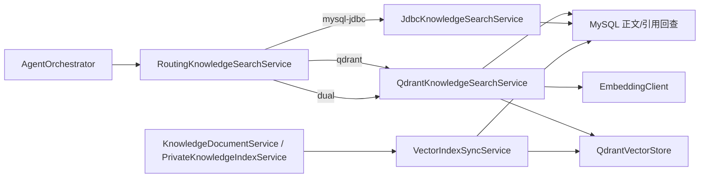

# 康伴 RAG：MySQL + Qdrant 落地说明

## 结论

本实现保留 MySQL 作为业务事实源和默认回退链路，并将 Qdrant 用作可重建的向量索引。文档正文、切片、发布状态、引用字段和权限事实仍在 MySQL；Qdrant 只保存向量、检索过滤所需的最小 Payload。

当前不接入 OCR。已有 OCR 私有病历索引链路可以在病历完成后同步到 Qdrant，但 OCR 服务本身不在本次改造范围内。

## 调用链



公共医院信息 MCP 仍是独立的公共信息工具；它不接收用户 ID、家庭成员 ID、病历、用药或完整患者上下文。患者私有数据继续留在 kangban-server 内部工具和 MySQL/RAG 链路中，不改成 MCP。

## 运行模式

| 配置 | 行为 | 用途 |
| --- | --- | --- |
| `mysql-jdbc` | 现有 MySQL 全量扫描、应用侧向量/关键词/RRF 排序 | 默认、无 Qdrant 时的安全回退 |
| `dual` | 访问 Qdrant 做可用性/召回验证，最终答案仍走 MySQL | 灰度和切换前对照 |
| `qdrant` | Qdrant 召回，MySQL 回查正文、引用和权限后再混合排序 | Qdrant 正式检索 |

Qdrant 不可用时：

- `qdrant` 模式抛出明确的 `VectorStoreUnavailableException`，不生成无依据医疗答案；
- `dual` 模式记录受控告警并回退 MySQL；
- `mysql-jdbc` 模式完全不访问 Qdrant。

## 索引同步和重建

`V17__add_vector_index_sync.sql` 保存每个索引切片的点 ID、Embedding 模型、状态、重试次数和最近错误。写入、重建、发布、撤回和删除会同步更新派生索引状态。

已有数据切换到 Qdrant 前，按以下顺序操作：

1. 启动 Qdrant，确认 `APP_QDRANT_URL`、Collection 名称和 Embedding 维度一致。
2. 先用 `APP_RAG_VECTOR_STORE=dual` 启动服务。
3. 使用知识库管理接口 `POST /admin/knowledge/vector-index/rebuild` 重建公共索引；可带 `documentId` 只重建一份文档。接口需要已登录用户和 `X-Knowledge-Admin-Token`。
4. 使用病历接口 `POST /medical-records/private-reindex/batch` 重建当前用户有权访问的历史私有病历索引。
5. 检查 `/actuator/health` 中 `qdrant` 指标和 `vector_index_sync` 状态，再将 `APP_RAG_VECTOR_STORE` 切为 `qdrant`。

Qdrant 是派生索引，丢失后可以重新执行上述重建；不要把 Qdrant 当作唯一业务数据库。

## 本地/服务器部署

`deploy/ecs/compose.infra.yml` 提供可选的 Qdrant 服务，默认不随 Redis/MinIO 启动：

```bash
cd /opt/kangban/infra
docker compose --profile qdrant --env-file .env -f compose.infra.yml up -d qdrant
curl -fsS http://127.0.0.1:6333/collections
```

生产环境不把 6333/6334 暴露到公网；Compose 已绑定到 `127.0.0.1`。如果使用托管 Qdrant，只需将 `APP_QDRANT_URL` 和占位符 `APP_QDRANT_API_KEY` 配置到服务器环境，不要写入 Git。

## 权限和数据安全

- 公共检索在 Qdrant 过滤 `scope=PUBLIC`、`documentStatus=PUBLISHED` 和当前 Embedding 模型，随后再次用 MySQL 状态过滤。
- 私有检索在 Qdrant 先过滤 owner、subject、member 和状态，MySQL 回查再次校验病历删除/撤销状态和成员范围。
- Agent 的 actor/subject/member 由服务端 `AgentExecutionContext` 提供，不接受模型或客户端传来的身份字段作为授权依据。
- 日志只记录耗时、数量、状态和错误类型，不记录正文、完整查询、向量、API Key 或私有下载地址。

## 测试与限制

定向测试覆盖：Qdrant REST 请求、Collection/过滤索引、公共和私有召回、MySQL 回查、混合排序、双读降级、索引同步、重建、健康状态和权限拒绝。

本地单元测试使用 Mock Qdrant Transport，不等价于真实 Qdrant 网络验收。真实 Qdrant 验收还需要在目标环境启动 Qdrant 后检查：Collection 维度、Payload 索引、发布/撤回、删除、重建、超时和应用重启后的检索结果。

Embedding 模型、维度和 Collection 不匹配时必须先重建索引，不能静默混用不同向量维度。
