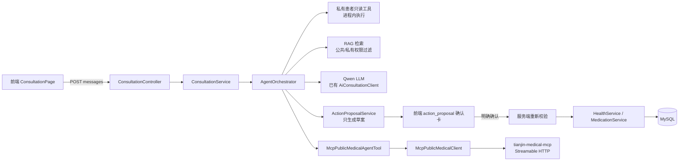
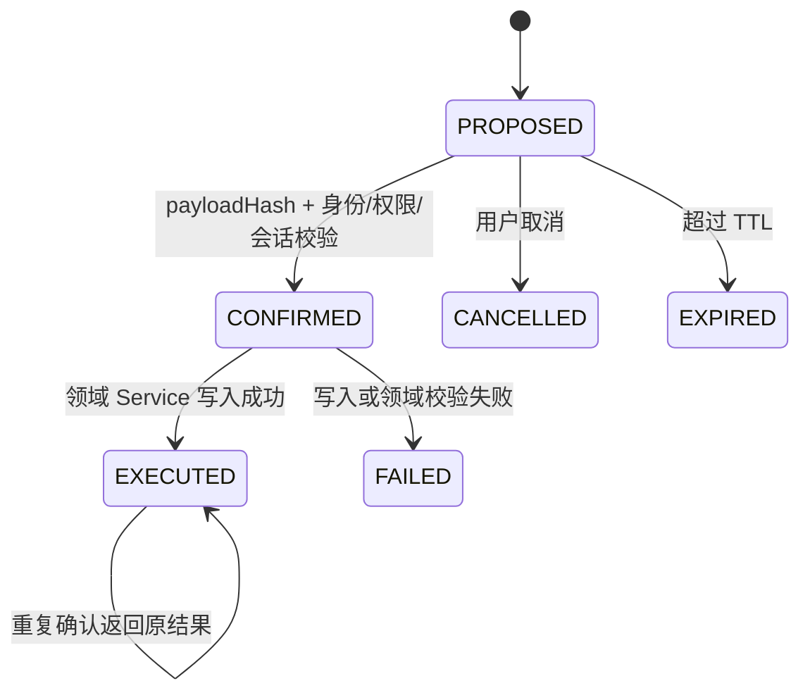

# 康伴 MCP 与 Agent 安全写入落地说明

## 1. 本次范围与结论

本次在现有 `kangban-server` 内完成了两类能力：

1. 新增独立的天津公共医疗信息 MCP 工具服务 `tianjin-medical-mcp`。
2. 在既有 `AgentOrchestrator` 上增加健康记录、用药计划的“草案—确认—执行”链路。

没有创建新的 Agent Server。患者私有数据工具仍在 `kangban-server` 进程内执行，MCP 只接收经过最小化的公开查询参数。

当前可以称为“安全写入闭环已落地的 Agent MVP”，但不能称为生产就绪的公共医疗信息服务：天津医院真实数据源、持久化目录、生产域名/HTTPS、线上监控和正式合规流程仍需补齐。

## 2. 当前调用链



问诊 SSE 仍然是：

`/consultation/sessions/{sessionId}/stream` → `ConsultationService.streamAiResponse` → `AgentOrchestrator.run`。

## 3. 公共医疗 MCP

### 3.1 服务能力

MCP 服务通过 Streamable HTTP 暴露：

- `search_hospitals`
- `get_hospital_info`
- `search_doctors`
- `search_departments`

每条记录只允许公共字段：医院 ID、医院名称、等级、科室、医生公开姓名、职称、地址、来源 URL、更新时间、状态。模型和 MCP 服务都不接收 `userId`、`memberId`、病历、用药或完整患者上下文。

### 3.2 数据状态

当前目录是内存目录，并提供管理导入接口。没有可靠真实来源时不会伪造数据：

- `DEMO`：明确标记的演示记录，只能用于开发测试。
- `IMPORTED`：通过受保护导入接口导入的目录记录，仍必须保留来源和更新时间。
- `EMPTY`：没有可用记录，不能当作“没有这家医院”的事实。

真实来源接入前，公共查询命中为空时 Agent 必须明确说明服务没有可靠数据，不能让模型自行补全医院、医生或出诊信息。

### 3.3 配置

MCP Server：

```text
TIANJIN_MCP_PORT=8092
TIANJIN_MCP_ADMIN_TOKEN=YOUR_MCP_ADMIN_TOKEN_HERE
```

`kangban-server`：

```text
APP_MCP_PUBLIC_ENABLED=false
APP_MCP_PUBLIC_SERVER_URL=http://127.0.0.1:8092
APP_MCP_PUBLIC_ENDPOINT=/mcp
APP_MCP_PUBLIC_REQUEST_TIMEOUT=5s
```

开发时先启动 MCP 服务，再将 `APP_MCP_PUBLIC_ENABLED` 改为 `true` 启动 `kangban-server`。所有令牌只能通过运行环境注入，不得写入仓库。

## 4. ActionProposal 状态机

数据库表：`agent_action_proposals`。



草案绑定：

- `actorUserId`：从认证身份取得。
- `subjectUserId`、`memberId`、`sessionId`：从会话和服务端上下文取得。
- `actionType`、`payloadJson`、`payloadHash`：保存本轮结构化草案。
- `expiresAt`：默认 300 秒，可通过 `APP_AGENT_ACTION_PROPOSAL_TTL_SECONDS` 配置，服务端最低 30 秒。
- `idempotencyKey`：以 proposal ID 唯一约束。

确认时会重新检查登录身份、会话患者、家庭权限、草案状态、有效期和哈希。Agent 不直接访问 Mapper 写入，成功后只能调用现有 `HealthService` 或 `MedicationService`，并由 `AuditService` 记录不含正文的动作摘要。

## 5. 健康记录填写

支持用户明确提供指标、数值、单位、日期和时间后生成健康记录草案。确认卡展示：患者、指标、数值、单位、日期、时间和备注。

缺少关键字段时只提出澄清问题，不猜测。确认后服务端重新执行指标范围检查、家庭成员权限检查和会话绑定检查，再调用现有健康记录服务。

## 6. 用药计划填写

支持用户明确提供药品名称、单次剂量、剂量单位、频率和提醒时间后生成用药计划草案；开始/结束日期只有用户明确提供时才写入。

以下请求不会生成写入草案：

- 推荐吃什么药。
- 增加、减少或调整剂量。
- 停药、换药或替用户形成处方。

确认卡明确展示“只记录用户提供的信息，不代表诊断或处方”。确认成功后调用现有 `MedicationService`，家庭成员用药写入使用新增 `ADD_MEDICATION` 权限，并记录审计。

## 7. 安全边界

- 患者只读工具不改成 MCP，避免把私有病历和用药数据跨进程发送到公共信息服务。
- 公共 MCP 规划器只提取医院、医生、科室等公开关键词；适配器再次拒绝患者称谓、健康指标、用药、病历、身份字段等内容。
- MCP 未启用、超时、空返回、工具失败或输入被拒绝时，Agent 停止相关回答并返回服务不可用提示，不静默让模型编造。
- 未确认的草案不触发任何业务写入。
- 重复确认返回同一执行结果，不重复创建记录。
- 日志只记录工具名、状态、错误类型、proposal ID/hash 等摘要，不记录患者正文、Chunk、令牌或密钥。

## 8. 测试结果

本轮已执行：

```text
tianjin-medical-mcp: mvn -q test                         5/5 通过
kangban-server: targeted Maven tests                    通过
kangban-server: mvn -q test                              210 通过，0 失败，0 错误，1 跳过
kangban-server: mvn -q -DskipTests package               通过
kangban-web: npm test                                    66/66 通过
kangban-web: npm run build                               通过
```

另外通过真实本地协议请求验证了 MCP：

1. `initialize` 返回 Streamable HTTP 会话和协议版本 `2025-03-26`。
2. `tools/list` 返回 4 个公共工具。
3. `tools/call` 可以返回 JSON 结果，包含 `source`、`dataStatus`、`resultCount` 和 `notice`。
4. 空目录返回 `dataStatus=EMPTY`，没有伪造医院记录。

测试只使用 H2 和 `example.invalid` 演示来源，不使用真实患者数据或真实密钥。Qwen 实时外部依赖测试仍按环境条件跳过；它不是本地代码失败，但不能据此宣称线上模型链路已验证。

## 9. 仍未完成

1. 接入并审核天津医院官方或授权数据源；当前 MCP 目录不提供真实线上医院数据。
2. 将目录从内存存储迁移到受控数据库或对象存储，并实现版本、删除和重建索引。
3. 为 MCP Server 配置生产 HTTPS、服务间认证、限流、审计和部署编排。
4. 在真实后端、前端和已登录浏览器环境中手动完成一次“问诊→草案→确认→数据库记录”路径；本轮完成了代码级、集成测试和协议级验证，未使用真实患者账号做自动写入。
5. OCR 仍未纳入本次范围。
